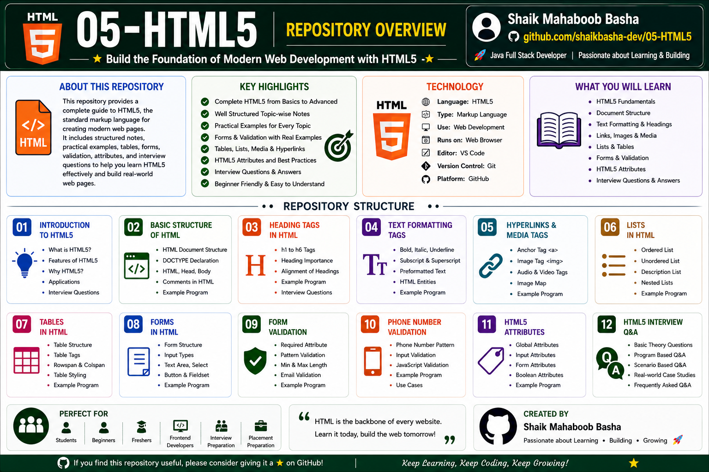

# HTML5

## Overview

This repository contains comprehensive notes, examples, practical programs, form validations, attributes, and interview preparation materials on **HTML5**.

HTML5 is the latest version of Hyper Text Markup Language used to create and structure web pages and web applications. It forms the foundation of Front-End Development and is one of the core technologies required for Java Full Stack Development.

The content in this repository is organized from basic to advanced concepts and includes:

* Introduction to HTML5
* Basic Structure of HTML
* Heading Tags
* Text Formatting Tags
* Hyperlinks and Media Tags
* Lists in HTML
* Tables in HTML
* Forms in HTML
* Form Validation
* Phone Number Validation
* HTML5 Attributes
* Interview Questions and Answers

Each topic contains theory, definitions, syntax, examples, practical programs, important tags, attributes, and interview-oriented content to help learners build a strong understanding of HTML5.

## Repository Overview

## Repository Structure

### 01 - Introduction to HTML5

This section introduces HTML5, web technologies, and the fundamentals of web development.

Topics Covered:

* Front-End Development
* Full Stack Development
* Web Technologies
* Web Applications
* Web Pages
* Website
* Introduction to HTML
* History of HTML
* HTML Tags
* Paired and Unpaired Tags

### 02 - Basic Structure of HTML

This section explains the fundamental structure of an HTML document.

Topics Covered:

* DOCTYPE Declaration
* html Tag
* head Tag
* title Tag
* body Tag
* Paragraph Tag
* HTML Document Structure

### 03 - Heading Tags in HTML

This section explains HTML heading tags and their hierarchy.

Topics Covered:

* h1 Tag
* h2 Tag
* h3 Tag
* h4 Tag
* h5 Tag
* h6 Tag
* Heading Hierarchy

### 04 - Text Formatting Tags in HTML

This section covers HTML tags used to format and structure text content.

Topics Covered:

* Bold Tag
* Italic Tag
* Underline Tag
* Mark Tag
* Strike Tag
* Preformatted Text
* Line Break Tag

### 05 - Hyperlinks and Media Tags in HTML

This section explains hyperlinks, images, audio, and video elements in HTML.

Topics Covered:

* Anchor Tag
* href Attribute
* target Attribute
* Image Tag
* Audio Tag
* Video Tag
* Source Tag

### 06 - Lists in HTML

This section explains the different types of lists available in HTML.

Topics Covered:

* Ordered List
* Unordered List
* Description List
* li Tag
* dl Tag
* dt Tag
* dd Tag

### 07 - Tables in HTML

This section explains how to create and organize tabular data using HTML tables.

Topics Covered:

* Table Tag
* Table Row
* Table Header
* Table Data
* Border Attribute
* Table Structure

### 08 - Forms in HTML

This section explains HTML forms and commonly used form controls.

Topics Covered:

* Form Tag
* Input Types
* Text Field
* Number Field
* Email Field
* Radio Buttons
* Checkbox
* Submit Button
* Fieldset
* Legend
* Datalist

### 09 - Form Validation in HTML

This section explains built-in HTML form validation and pattern-based input validation.

Topics Covered:

* Required Attribute
* Placeholder Attribute
* Pattern Attribute
* Title Attribute
* Username Validation
* Regular Expressions (Regex)

### 10 - Phone Number Validation in HTML

This section explains phone number and mobile input validation using HTML patterns.

Topics Covered:

* Tel Input Type
* Pattern Attribute
* Mobile Number Validation
* Regex Validation
* Form Validation Techniques

### 11 - Attributes in HTML5

This section covers commonly used HTML5 global and element-specific attributes.

Topics Covered:

* Global Attributes
* id Attribute
* class Attribute
* style Attribute
* title Attribute
* lang Attribute
* Anchor Attributes
* Image Attributes
* Audio Attributes
* Video Attributes
* Table Attributes
* Form Attributes
* Input Attributes

### 12 - HTML5 Interview Questions and Answers

This section contains interview-oriented questions covering important HTML5 concepts.

Topics Covered:

* Introduction to HTML5
* HTML vs HTML5
* Semantic Elements
* Forms and Validation
* Tables and Lists
* Audio and Video Tags
* Attributes
* HTML Document Structure
* Frequently Asked Interview Questions

## Features of This Repository

This repository provides:

* Beginner to advanced HTML5 concepts
* Well-structured learning path
* Detailed theory notes
* Practical HTML programs
* HTML forms and validation
* Multimedia elements
* Tables and lists
* HTML5 attributes
* Real examples
* Interview questions and answers
* Suitable for revision and technical interviews

## Technologies Used

* HTML5
* Front-End Development
* Visual Studio Code
* Web Browser
* Git
* GitHub
* Markdown

## Interview Preparation

Interview questions and answers cover:

* HTML5 Fundamentals
* HTML vs HTML5
* HTML Document Structure
* Heading and Text Formatting Tags
* Hyperlinks and Media Elements
* Lists and Tables
* Forms and Input Types
* Form Validation
* HTML5 Attributes
* Semantic Elements
* Audio and Video Tags

The interview preparation content is structured to strengthen HTML5 fundamentals and support front-end and Java Full Stack technical interview preparation.

## Purpose

This repository is created to:

* Build strong HTML5 concepts
* Understand modern web page structure
* Learn HTML forms and validation
* Practice HTML through practical examples
* Develop Front-End Development skills
* Prepare for HTML and Front-End interviews
* Strengthen Java Full Stack Developer skills
* Maintain structured HTML learning notes
* Support quick revision and placement preparation

## Repository Highlights

* 12 structured HTML5 sections
* Theory, examples, and practical programs
* HTML document structure
* HTML forms and validation
* Multimedia tags
* Tables and lists
* HTML5 attributes
* Interview questions and answers
* Beginner-friendly learning structure
* Interview-oriented content

## Who Can Use This Repository

This repository is useful for:

* Beginners learning HTML5
* Front-End Development students
* Java Full Stack Development learners
* College students
* Freshers preparing for technical interviews
* Placement preparation
* HTML and Front-End interview preparation
* Developers revising HTML5 fundamentals

## Author

**Shaik Mahaboob Basha**

B.Tech - Electronics and Communication Engineering

Aspiring Java Full Stack Developer

## Future Improvements

Additional advanced topics may include:

* Semantic HTML5
* HTML Canvas
* SVG Graphics
* Geolocation API
* Drag and Drop API
* Web Storage API
* Audio and Video Advanced Features
* Responsive HTML Techniques

## Support

If this repository helps you in your learning journey, interview preparation, or future reference, please consider giving it a **Star ⭐**. Your support is greatly appreciated and motivates me to continue creating high-quality educational repositories.

## Conclusion

This repository is created as a comprehensive HTML5 learning and interview preparation resource. It contains HTML5 fundamentals, document structure, practical examples, forms, validation techniques, multimedia elements, attributes, and interview questions arranged in a structured manner for easy learning, revision, and technical interview preparation.

Happy Learning and Keep Coding!
